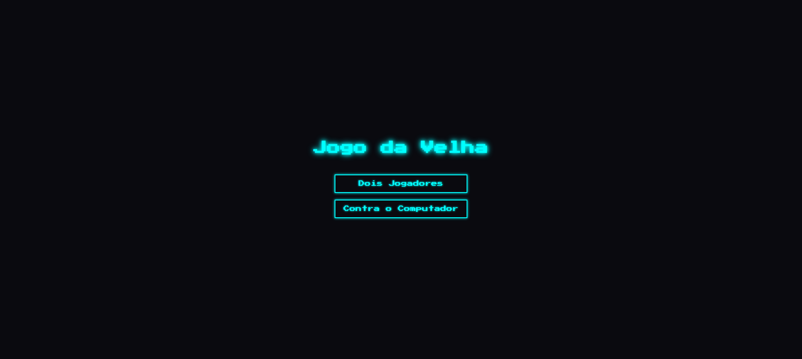
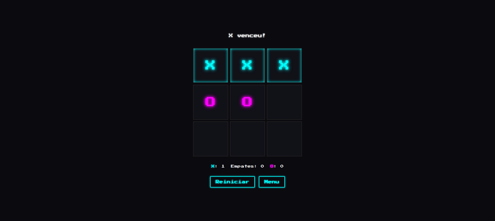

# Showcase — Jogo da Velha (Tic-Tac-Toe)

End-to-end proof of concept built with **kimi-plugin-cross-platform v0.2.0**.

This document is the evidence that the plugin's core workflow — *host plans, Kimi
implements, an independent model reviews, host runs functional tests* — works from
start to finish on a real, deployable app.

- **Source repo:** https://github.com/luhfilho/jogo-da-velha-kimi-demo
- **Live demo (GitHub Pages):** https://luhfilho.github.io/jogo-da-velha-kimi-demo/
- **Stack:** pure vanilla HTML/CSS/JavaScript (no frameworks, no build step)

## The app

A retro/neon Tic-Tac-Toe with:

- An initial menu to pick **2 players (local PvP)** or **vs. computer (PvC)**.
- A random AI (PvC) with a ~400 ms "thinking" delay; the board locks during the
  machine's turn.
- Session scoreboard (X / draws / O), winning-line highlight (pulse-glow), restart
  (keeps score), and back-to-menu (resets score).
- A single `state` object as the source of truth; the DOM only reflects it. Clicks
  use event delegation (one listener on the grid).

## The pipeline

| Step | Tool | What it did |
|------|------|-------------|
| 1. Plan | Claude Code (host) | Defined requirements, architecture, and the implementation plan. |
| 2. Implement | Kimi via `/kimi:code` | Wrote `index.html`, `styles.css`, `script.js`. |
| 3. Review | Codex (adversarial review) | Found 5 issues, including a critical AI race condition. |
| 4. Fix | Kimi | Applied the fixes (generation token + `clearTimeout`, hover lock, score reset). |
| 5. Test | Chrome DevTools (MCP) | 7 functional scenarios — all passed, console clean. |

### Critical bug caught by the adversarial review

In PvC mode the AI move is scheduled with `setTimeout(~400ms)`. If the player hit
**Restart** before the timer fired, the stale callback still ran and dropped a
"ghost" move onto the fresh board (because `restartGame()` sets `active` back to
`true`, the existing `if (!state.active)` guard did not stop it).

**Fix:** a monotonically increasing **generation token** captured when the timer is
scheduled and re-checked inside the callback, combined with `clearTimeout` on
restart / back-to-menu. The functional test reproduces the exact scenario and
confirms no ghost move lands.

### Functional test results

All scenarios driven through real DOM events in Chrome:

1. Menu renders both modes ✅
2. PvP alternates X/O; clicks on occupied cells ignored ✅
3. Win → status, highlighted line, score +1, board locked ✅
4. Draw → "Empate!", draws +1 ✅
5. Restart clears the board but keeps the score ✅
6. PvC → AI replies in ~400 ms; human cannot play while it "thinks" ✅
7. **Critical fix** → restart before the AI fires leaves an empty board (no ghost move) ✅

Console: only a benign `favicon.ico` 404 (the app does not reference one).

## Evidence

| Initial menu | Win (highlighted line) |
|--------------|------------------------|
|  |  |
